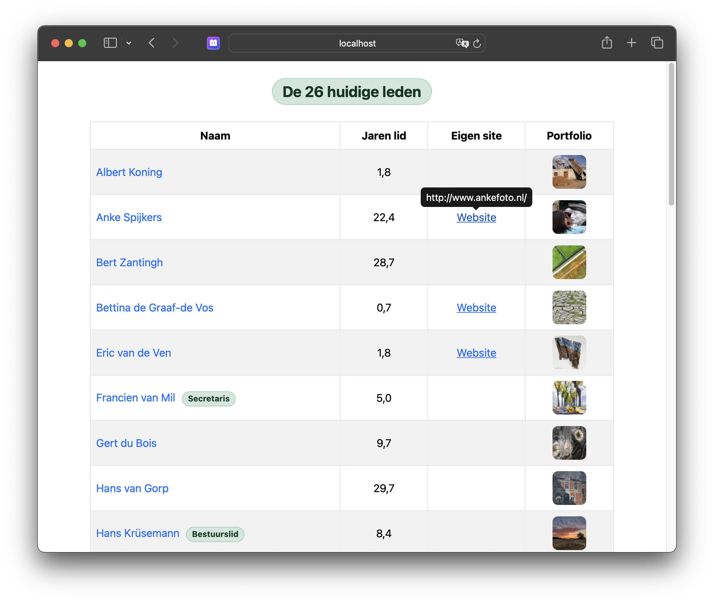

[![Version][stable-version]][version-url]
[![Contributors][contributors-shield]][contributors-url]
[![Forks][forks-shield]][forks-url]
[![Stargazers][stars-shield]][stars-url]
[![Issues][issues-shield]][issues-url]
[![Discussions][discussions-shield]][discussions-url]
[![MIT License][license-shield]][license-url]

# Photo-Club-Hub-HTML

This MacOS app is a companion to the iOS app vdhamer/Photo-Club-Hub.
It generates static HTML websites using [twostraws/ignite](https://github.com/twostraws/ignite).
The target domain is amateur photo clubs that publish the work of their members online.

> The idea is to provide a centralized portal/_hub_ to view images that are managed locally (clubs manage their own data). 

This data forms a hierarchy with three levels: 

1. central root list of participating clubs (hundreds),
2. local lists of members (dozens per club),
3. and portfolios with the work of individual club members (dozens of images per member).

The iOS app reads a tree of JSON files, and renders these in SwiftUI.
CoreData is used as a cache to ensure that you see some data immediately while the JSON is refreshing in the background.

It would be possible to implemement an equivalent app for Android,
but that still leaves PC users and other platforms out in the cold.
So this (unfinished) app intends to read the same JSON files used by the iOS app.
It generates static web sites that clubs can integrate into their web sites (often WordPress).

## Comparison to iOS app

TODO: add corresponding screenshots, and maybe table containing feature comparison.

## Static sites and Ignite

This app runs on MacOS because it generates a directory with a few files and subdirectories (CSS, Javascript, image assets).
These are generated on a Mac and then copied over to a club's server via e.g. FTP or maybe a Wordpress plug-in.
In theory the app _could_ be made to run on iOS, but iOS shouldn't be confronted with files and folders.

The data being displayed on the individual HTML sites gets updated roughly 10 or 20 times per year.
Because the update frequency is relatively low, but because the owners of the data are assumed to have limited "computer" expertise,
it is best to generate static web sites. This still involves some hasstle with directories and passwords.
But this is easier than having a dynamic backend based on PHP, Swift Vapor, Java EE, Docker, etc.

**Ignite** comes into all this because, it allows developers to write code in Swift 
that defines the content of the static website without having to deal with HTML/CSS/Javascript.
It just generates these from a higher-level description that resembles data more than code.
The declarative code for this is sometimes considered a _domain-specific-language_ and uses Function Builder syntax tricks.

Apart from requiring overwriting of the HTML site when the user-provided content changes, here is an example of a limitation of
static HTML we ran into: the app has input data saying when somebody joined the club. If you want to express that as "been a member for </somany>
years", you can only calculate this at site-creation time.
I solved this with a conbination of hover text (showing "joined on Jan 1st 2010") and a footer stating how recently the site has been regenerated.

## Roadmap

- [ ] Fix the code (requested help from the team behind twostraws/Ignite) so that the rendering works.
- [ ] Load the membership list from a .level2.json file. Currently the app contains a copy of some of the data.
- [ ] provide a UI by which the user can select a club for which to generate a local site.
- [ ] possibly generate a static site that can serve as index of supported clubs.
- [ ] possibly create one or more editor apps for managing the content in the JSON files

(<a href="#top">back to top</a>)

<!-- MARKDOWN LINKS & IMAGES -->
<!-- https://www.markdownguide.org/basic-syntax/#reference-style-links -->
[stable-version]: https://img.shields.io/github/v/release/vdhamer/Photo-Club-Hub?style=plastic&color=violet
[version-url]: https://github.com/vdhamer/Photo-Club-Hub/releases

[contributors-shield]: https://img.shields.io/github/contributors/vdhamer/Photo-Club-Hub?style=plastic
[contributors-url]: https://github.com/vdhamer/Photo-Club-Hub/graphs/contributors

[forks-shield]: https://img.shields.io/github/forks/vdhamer/Photo-Club-Hub?style=plastic&color=teal
[forks-url]: https://github.com/vdhamer/Photo-Club-Hub/network/members

[stars-shield]: https://img.shields.io/github/stars/vdhamer/Photo-Club-Hub?style=plastic
[stars-url]: https://github.com/vdhamer/Photo-Club-Hub/stargazers

[issues-shield]: https://img.shields.io/github/issues/vdhamer/Photo-Club-Hub?style=plastic
[issues-url]: https://github.com/vdhamer/Photo-Club-Hub/issues

[discussions-shield]: https://img.shields.io/github/discussions/vdhamer/Photo-Club-Hub?style=plastic?color=orange
[discussions-url]: https://github.com/vdhamer/Photo-Club-Hub/discussions

[license-shield]: https://img.shields.io/github/license/vdhamer/Photo-Club-Hub?style=plastic
[license-url]: https://github.com/vdhamer/Photo-Club-Hub/blob/main/.github/LICENSE.md
